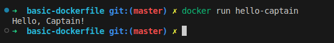

# Hello Captain Docker Image


This project contains a simple Dockerfile to create a Docker image that prints **"Hello, Captain!"** to the console when run.

## Features

- Lightweight base image: **Alpine Linux** (`alpine:latest`)
- Simple and efficient: Prints a message and exits
- Includes metadata using Docker labels

## Requirements
- Docker installed on your system ([Download Docker](https://www.docker.com/products/docker-desktop))


## Roadmap 
- Roadmap.sh Project URL: https://roadmap.sh/projects/basic-dockerfile

## Usage

### 1. Clone the Repository

```bash
git clone git@github.com:Rushan-Chithranga/deveops-projects.git
cd deveops-projects/basic-dockerfile
```

### 2. Build the Docker Image

Run the following command to build the Docker image:

```bash
docker build -t hello-captain .
```

### 3. Build the Docker Image

Run the following command to run the Docker image:

```bash
docker run hello-captain
```

## Output

